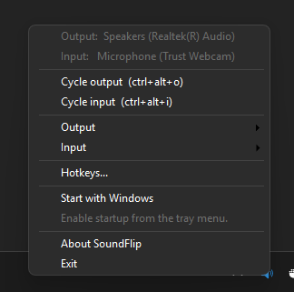
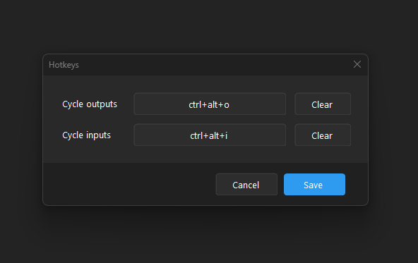
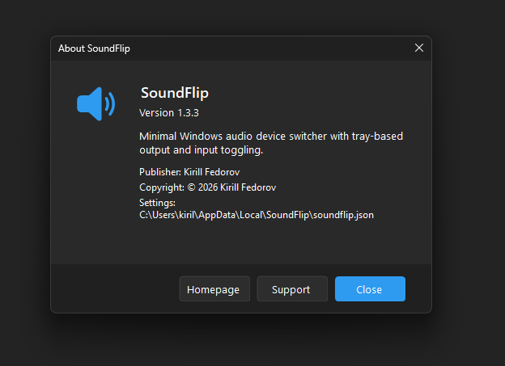

# SoundFlip — minimal Windows audio device switcher

A small Windows utility that lives in the tray and switches **playback and
recording** devices on global hotkeys — cycle through a ring of outputs or a
ring of inputs, picked with checkboxes right in the tray menu. Call and voice
apps (Teams, Discord, Zoom, ...) follow the switch, mic included.

<p align="center">
  
</p>

<p align="center">
  <a href="https://apps.microsoft.com/detail/9nz9f23hxfsb">
    
  </a>
</p>

Prefer a plain download? Grab the zip from the
[latest release](https://github.com/geronimonzy/soundflip/releases/latest) —
a single self-contained exe, nothing to install.

## Commands

```
soundflip                          launch the tray app
soundflip list [outputs|inputs]    list active devices (* = current default)
soundflip set [output|input] <name>
                                   set the default device (case-insensitive substring)
soundflip cycle [outputs|inputs]   advance the chosen ring to its next device
soundflip help                     show the usage text
```

The scope words are optional and default to outputs, so `soundflip list`,
`soundflip set <name>`, and `soundflip cycle` work on playback devices.

## Build

Needs the .NET 8 SDK on Windows. From this folder in PowerShell:

```powershell
.\build.ps1
```

This produces a single self-contained `dist\soundflip.exe` (no .NET install
needed to run it). Launching it never opens a console window; CLI commands
print into the terminal they were started from.

## Tray app

Run `soundflip` — a speaker icon appears in the notification area. Right-click
it for everything:

- **Cycle output / Cycle input** — jump to the next device in the ring.
- **Output / Input** — live checklists of your active devices. Tick the ones
  you want in the cycle ring (the menu stays open so you can tick several);
  ● marks the current default. Changes take effect immediately.
- **Hotkeys…** — set both cycle hotkeys in one window. Defaults to
  `Ctrl+Alt+O` for outputs; combos are any modifiers plus a letter, digit, or
  F-key. If another app already owns a combo, SoundFlip warns you once and
  keeps the rest working.
- **Start with Windows** — SoundFlip starts silently in the tray every time
  you sign in. Toggle it off the same way.
- **About SoundFlip** — version and links.
- **Exit**.

Double-clicking the icon cycles the output ring. Every switch shows a small
toast with the new device name, and the icon tooltip always shows the current
output. The menu, dialogs, and toasts follow your Windows light/dark theme.

<p align="center">
  
  
</p>

Your device picks and hotkeys are saved automatically to
`%LocalAppData%\SoundFlip\soundflip.json` — safe to hand-edit if you like.

## How it works

- Every switch sets both the *default* device and the *default communications*
  device, for outputs **and** inputs — that's what makes call apps follow the
  change instead of clinging to the old device.
- Setting the default device uses the Windows `IPolicyConfig` COM interface
  (via the `AudioSwitcher.AudioApi.CoreAudio` library) — the only way to *set*
  (not just read) the default audio device on Windows.
- The hotkeys use Win32 `RegisterHotKey` + a message loop, so they work
  system-wide while the tray app runs in the background.

## License & privacy

SoundFlip is [MIT-licensed](LICENSE). It collects no data whatsoever — no
telemetry, no network access; settings live in one local JSON file. See
[PRIVACY.md](PRIVACY.md) for the full statement.

## Credits

The speaker icon is the "Speaker 2" glyph from
[Fluent UI System Icons](https://github.com/microsoft/fluentui-system-icons)
by Microsoft, used under the MIT license.
